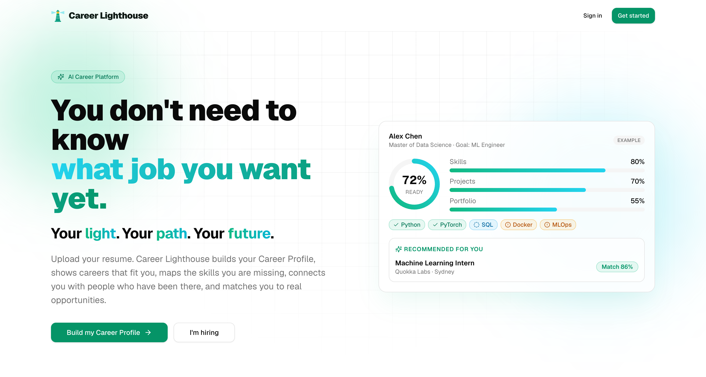
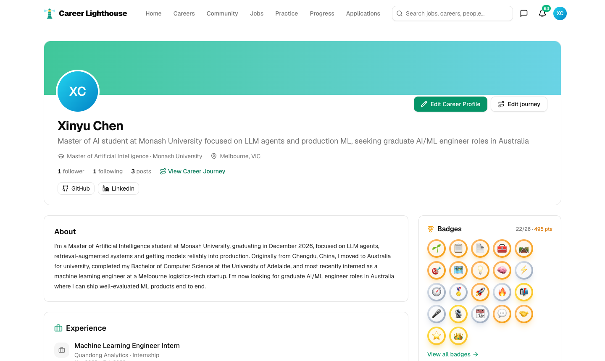

<div align="center">

# 🗼 Career Lighthouse

### *Your light. Your path. Your future.*

An AI career-growth, community and recruiting platform<br/>for university students, graduates and early-career talent.

[**🌐 Live Demo**](https://jade-web-five.vercel.app) · [📖 中文文档](README-zh.md) · [📋 Tech Report](TECH_REPORT.md)


🏆 **Built for the [Futura Remix Hackathon 2026](https://futuraremix.mentor-me.com.au/offline-hackathon) (offline track)**

🎬 **[Watch the demo video](video.mp4)** · 🔑 **Demo account** — email `xinyu.chen.demo@example.com` · password `123456`<br/>
<sub>A seeker profile with three months of activity: 26 applications, 3 interviews, 69 practised questions, 22 badges.</sub>



</div>

> The repository keeps its original name `JADE_Web`; the product is **Career Lighthouse**.

Built around each user's Career Profile, it covers the full journey:

**Self-discovery → Career discovery → Planning → Skill building → Community → Job discovery → Recruiter chat → Applications → Progress tracking**

## ✨ Highlights

- 📄 **Resume → Career Profile in one upload** — AI extracts education, experience, projects and skills; you review before anything is saved
- 🎯 **Explainable career & job matching** — readiness scores and skill-gap breakdowns from a transparent rule-based algorithm, with AI-written "hidden potential" insights
- 🗺️ **Skill gap → monthly roadmap → AI Career Plan** — the full plan exports as a polished PDF (Pro feature, free during the beta)
- 💼 **620+ real job listings** with match insights, source links and a full application tracker
- 🧠 **112-question interview bank** across 8 fields, from AI agents to behavioural rounds
- 🏅 **26 data-derived badges**, streaks and a GitHub-style activity heatmap — impossible to fake, satisfying to earn
- 💬 **Communities, career journeys and realtime recruiter chat**
- 🧭 **A five-step getting-started guide** that ticks itself off as new users explore

<div align="center">

<br/><sub>A member's public profile: badges, activity and their career journey in one shareable link.</sub>
</div>

## 🧭 Feature map

| Module | Pages | Notes |
|---|---|---|
| Accounts | `/auth/login`, `/auth/sign-up` | Email sign-up and login |
| Onboarding | `/onboarding` → `resume` → `review` → `preferences` → `complete` | Pick a role, upload a resume, review the AI-extracted profile, preference questionnaire, build the Career Profile |
| Home | `/dashboard` | Profile summary, current goal and next steps, recommended jobs, community feed; new users see a five-step getting-started card (done states derive from data; it disappears once complete) |
| Career Profile | `/profile`, `/settings` | Full profile editing; privacy and visibility |
| Career planning | `/careers`, `/careers/[id]`, `/skill-gap`, `/roadmap`, `/plan` | Career recommendations, hidden potential, career details, skill gap, staged roadmap, Career Readiness, AI Career Plan |
| Community | `/community`, `/community/c/[slug]`, `/community/post/[id]`, `/journey`, `/u/[id]` | Career/company/university communities, posts, Career Journey, public profiles (with badge wall and activity heatmap), follows |
| Growth | `/practice`, `/progress` | Interview question bank (112 original questions across 8 fields), GitHub-style activity heatmap (applications / interviews / practice), stats panel, 26 achievement badges |
| Messages | `/messages` | Direct messages and recruiter chat (realtime) |
| Jobs | `/jobs`, `/jobs/[id]`, `/jobs/[id]/apply`, `/applications` | Personalised recommendations, match scores, guided applications, application tracker; paginated listings with links to original job ads |
| Employers | `/employer`, `/employer/jobs/new`, `/employer/jobs/[id]/candidates`, `/employer/candidates/[id]`, `/employer/discover` | Post jobs, manage candidates, skills evidence, discover talent, invite to apply/interview |
| Other | `/notifications`, `/search` | Notification centre, global search |

## 🤖 AI features and LLM integration

Every LLM-backed feature goes through `askLLM()` in `lib/ai/llm.ts`: an OpenAI-compatible endpoint (`openai` SDK, defaulting to Alibaba Cloud DashScope + `GPT5.6`), streamed responses, strict `json_schema` output validated with zod. When the endpoint's constrained decoding garbles the output, the call retries in `json_object` mode with the schema embedded in the prompt. Plan sub-sections are capped at 3 bullets, and the model marks a handful of key points with `**…**`, rendered as highlights.

| Feature | Trigger | Thinking | Timeout | Rule-based fallback |
|---|---|---|---|---|
| Resume parsing | After a resume upload | off | 100 s | `resume-parser.ts` |
| Hidden-potential reasons | Career discovery, dashboard (cached per profile for a day) | off | 30 s | `matching.ts` |
| Career Roadmap | Setting a goal, regenerating | off | 75 s | `roadmap.ts` |
| AI Career Plan (`/plan`) | First visit or Regenerate | off | 240 s | `career-plan.ts` |

Measured with GPT5.6: resume parsing ~30 s, roadmap ~35 s, career plan ~50 s. Thinking mode doubles the latency with little quality gain, so it is off; set `effort` to `"medium"` or `"high"` per call in `lib/ai/index.ts` if needed.

**Growth system**: `/practice` is the question bank (read → answer out loud → compare with the model answer → tick), covering AI agents, machine learning, data science, system design, behavioural interviews, product & design, software engineering and finance. `/progress` shows LeetCode-style stats (applications / interviews / questions / reputation, each with a last-week delta), a GitHub-style 12-month activity heatmap, and 26 badges (bronze/silver/gold with points). Every number is derived from existing rows (application_events, practice_progress, posts, likes, conversations, comments) — no counters to keep in sync. Badges are awarded server-side by `refresh_achievements()` from real data, so they cannot be faked from the client. All questions are original (agent topics take their taxonomy from open-source interview collections; the content is fully rewritten).

**AI Career Plan page and PDF**: `/plan` shows a summary only (where you are, strategy, phases at a glance, this week). The full version (per-phase action lists, weekly rhythm, milestones, matched jobs, alternative paths, risks) is generated as a PDF by `/plan/pdf` (`pdfkit`, server-side). Downloading is a **Career Lighthouse Pro** feature (`profiles.is_pro`), free during the beta: non-Pro users get an upgrade dialog with one-click activation. Plan generation shows a step-by-step progress animation.

**Configuration**: set `DASHSCOPE_API_KEY`, `LLM_BASE_URL` and optionally `LLM_MODEL` in `.env` and on Vercel; switching to any other OpenAI-compatible service only requires changing these three. If they are missing, or a call fails, times out or returns malformed output, `askLLM()` returns `null` and the feature falls back to its rule-based algorithm — pages never break. `/plan` states which model generated the plan.

## 🧱 Stack

| Part | Technology | Responsibility |
|---|---|---|
| Frontend | Next.js 16 (App Router) + Tailwind + shadcn/ui | Pages and interaction |
| Backend | Supabase | Postgres (RLS on every table), auth, resume storage, realtime messaging |
| Hosting | Vercel | Auto build & deploy on push to `main` |

## 🛠️ Local development

Requires Node.js 20+.

```bash
npm install
cp .env.example .env   # then fill in real values; sources are noted in the file
npm run dev            # open http://localhost:3000
```

Environment variables the site itself uses:

- `NEXT_PUBLIC_SUPABASE_URL`
- `NEXT_PUBLIC_SUPABASE_PUBLISHABLE_KEY`
- `DASHSCOPE_API_KEY`, `LLM_BASE_URL`, `LLM_MODEL` (optional; enables LLM-generated AI features, see above)

The remaining `PG*` / `DATABASE_URL` entries in `.env.example` are for tools that connect to the database directly (migrations etc.); the site does not need them and they should not be set on Vercel.

## 🚢 Deployment

Push to `main` and Vercel redeploys the live site automatically; other branches get their own preview URLs.

Vercel environment variables: the two `NEXT_PUBLIC_` values are required; add `DASHSCOPE_API_KEY`, `LLM_BASE_URL` and `LLM_MODEL` to enable the LLM.

## 🔐 Supabase auth configuration

Supabase dashboard → Authentication → URL Configuration:

- **Site URL**: `https://jade-web-five.vercel.app`
- **Redirect URLs**:
  - `http://localhost:3000/**` (local development)
  - `https://*-jade-e2a9.vercel.app/**` (Vercel preview deployments)

**Email confirmation is currently off** (Authentication → Sign In / Providers → Confirm email); any email can sign up and log in straight away. Supabase's built-in mailer only delivers to organisation members and is rate-limited per hour.

Before a public launch: configure custom SMTP under Authentication → Emails (e.g. Resend, requires your own domain), then re-enable Confirm email. The sign-up page supports both modes without code changes. Until then, "forgot password" emails also only reach organisation members.

## 📁 Layout

```
app/(app)/          Signed-in pages (shared top navigation)
app/auth/           Login and registration pages
app/page.tsx        Landing page
components/app/     Shared components (nav, match badges, skill chips, readiness ring, …)
components/ui/      shadcn/ui primitives
lib/ai/             AI features (LLM entry point + rule-based algorithms)
lib/data/           Data loaders (careers, profiles, jobs, growth)
lib/actions/        Server Actions
lib/auth.ts         Session and role checks
supabase/migrations Database migrations
evals/              AI output evals (used by the eval-gate CI check)
proxy.ts            Refreshes the session per request; redirects signed-out visits to login
```

Database connection notes and gotchas: [CONNECTION.md](CONNECTION.md).

## 👥 Team JADES

| Name | Role |
|---|---|
| **Jianling Tang** | Data Scientist |
| **Kuiye Ding** | Software Engineer |
| **Xiangqi Peng** | Communication Lead |
| **Yichen Duan** | Business Analyst |
